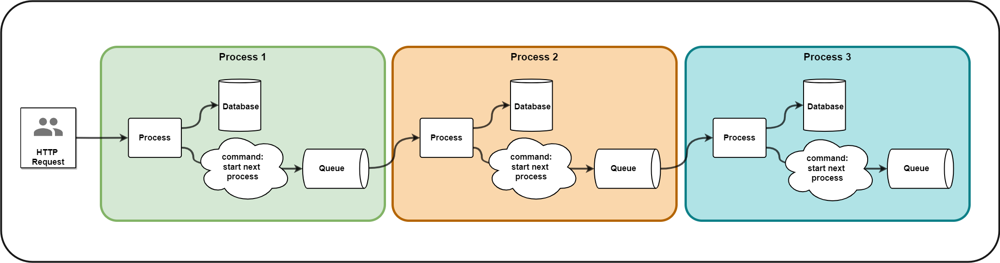
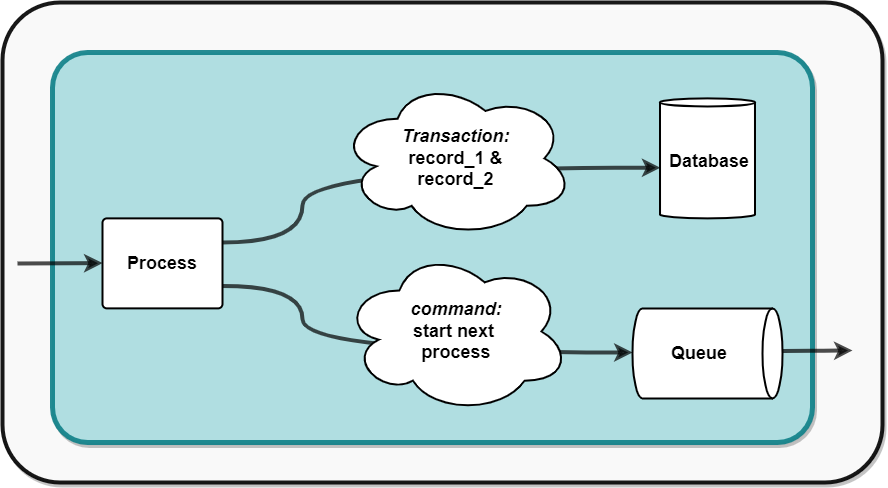
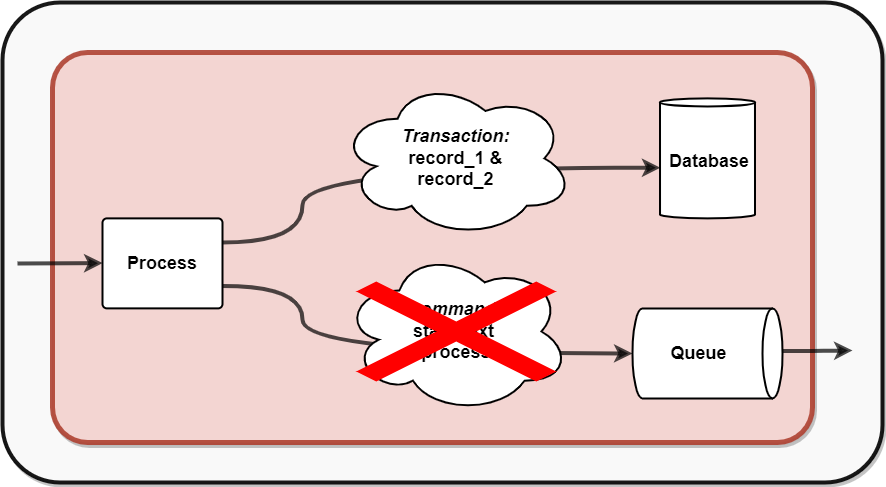
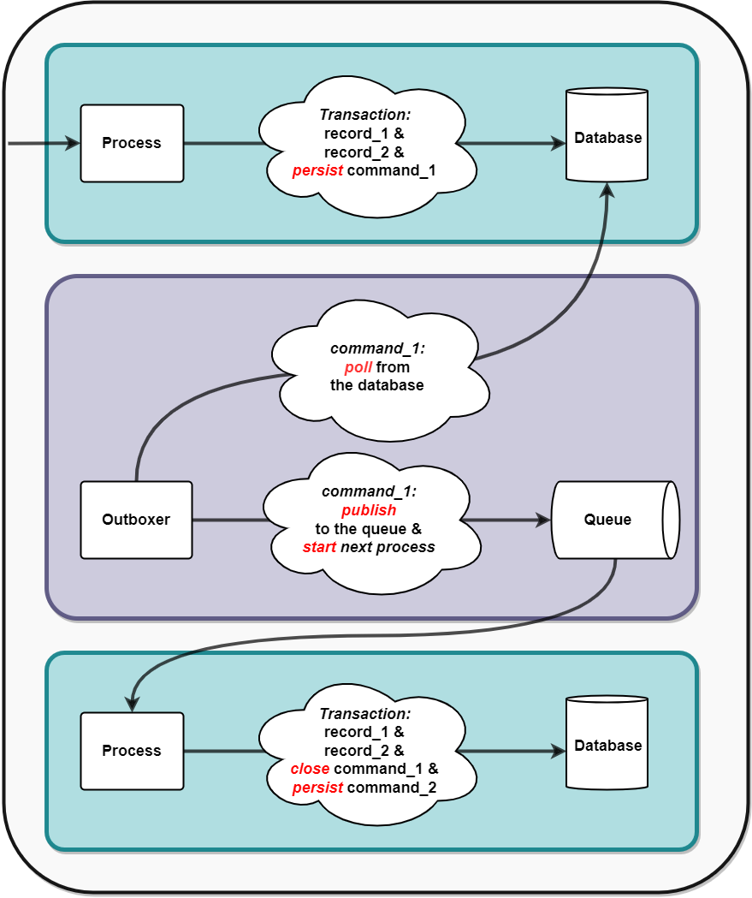
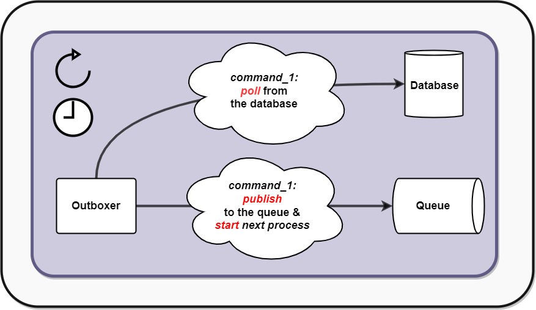
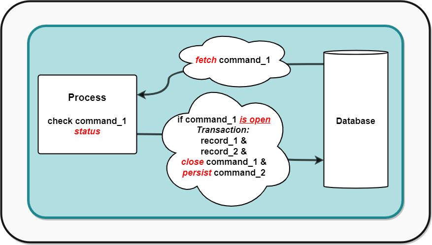
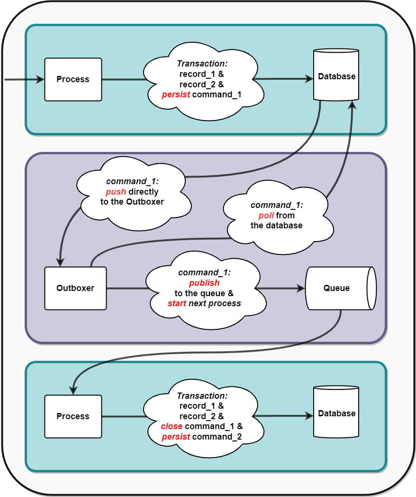
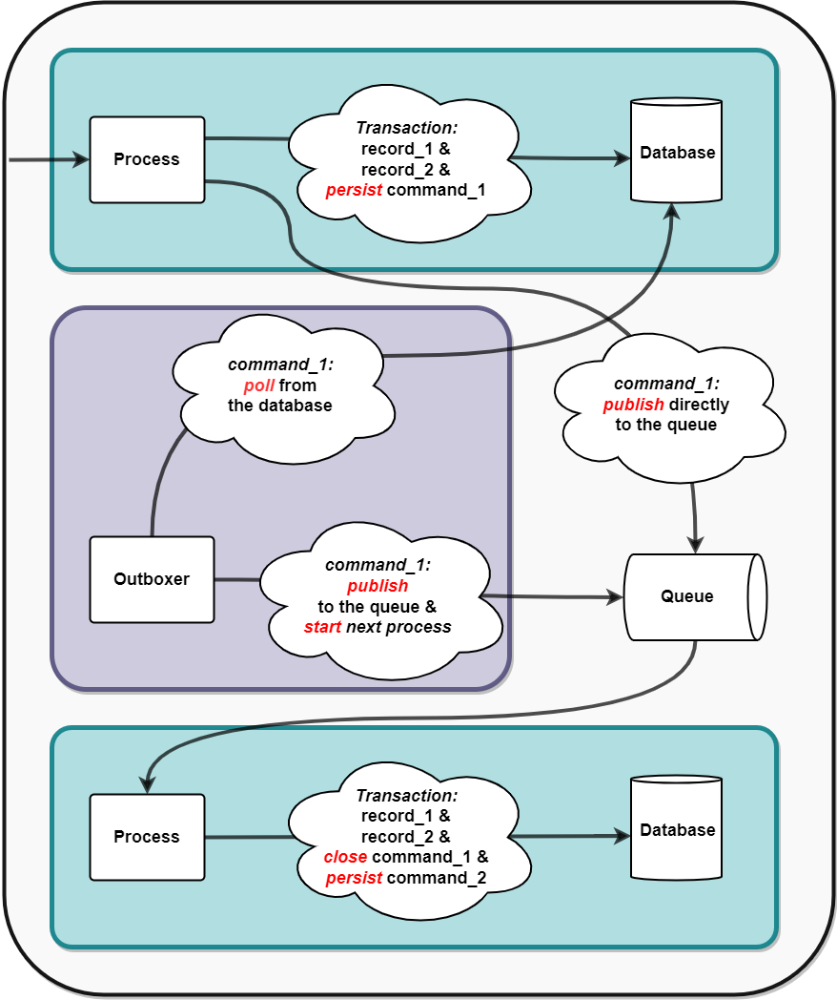

## Outbox Pattern

### Understanding the Workflow Pattern

In distributed systems, a workflow is a sequence of processes or steps that collaborate to achieve a specific business goal. Each process in the workflow typically completes its task and passes control to the next step. This handoff often involves publishing an event to a queue, which the next process consumes and acts upon. But why introduce a queue instead of processing everything in a single transaction?

#### Reasons to Use Queues in a Workflow
1. **Asynchronous Processing**: Queues decouple processes, enabling asynchronous execution. For example, a long-running task like generating a report can be processed independently without holding up the main workflow.
2. **Scalability**: With a queue, you can scale consumers to handle higher volumes of events without impacting the upstream processes.
3. **Fault Tolerance**: If the downstream process fails, the event remains in the queue for retry. This ensures reliability in the system.
4. **Separation of Concerns**: Each process focuses on its specific task and publishes an event to delegate the next step, maintaining clear logical boundaries.

---
#### Workflow Pattern

**Process 1:**
This process handles the execution of a long-running task in an asynchronous way. It prevents blocking or delays in upstream systems, enables scalability by processing tasks independently.

**Process 2:**
This process uses message affinity to ensure that events belonging to the same group are routed to the same processing unit. This ensures sequential processing without the need for locks.

**Process 3:**
This process uses a queue to maintain its logical boundaries, ensuring it remains focused on its core business responsibility. By publishing events to a queue instead of directly invoking downstream logic, the process achieves separation of concerns and avoids coupling to other processes. This design promotes modularity, scalability, and flexibility across the system.

---

### Critical Traits of a Reliable Workflow

In a distributed system, events may be published multiple times due to retries or failures. To ensure **reliability** and achieve the **exactly-once guarantee**, the workflow must handle duplicates safely and without side effects. This is achieved through **Idempotency** and **Affinity**. 
1. **Idempotency:**
Idempotency ensures that processing the same event repeatedly produces consistent results without side effects. For instance, if a payment event is processed multiple times, idempotency guarantees that the user's account is only charged once. This is typically implemented by assigning a unique identifier to each event and checking if it has already been processed before applying any changes. Idempotency is a cornerstone of reliability in distributed systems, as it mitigates the risks posed by retries and duplicate messages.
2. **Affinity:**
Affinity guarantees that all instances of the same event are routed to the same processing unit. This prevents race conditions, where multiple instances of the same event could be processed concurrently, leading to conflicts or inconsistent outcomes. Affinity is often achieved by using mechanisms like partitions in Kafka or message groups in SQS, ensuring that related events are handled in sequence by the same consumer. By preserving the logical grouping of events, affinity maintains order and consistency across the workflow.

### Process Under the Microscope?

Let’s focus on the process in detail. This process performs calculations, persists the results in a database as part of a single transaction, and publishes a command to trigger the next step in the workflow. However, without proper safeguards, failures can lead to inconsistencies or unprocessed events. So, what are the potential pitfalls?

---

### What Could Possibly Go Wrong?

The process is neither ACID nor BASE, leaving it vulnerable to inconsistencies. Without ACID properties, the database and queue operations are not atomic, meaning partial successes can leave the system in an incomplete state. For example, if the database transaction succeeds but the event fails to publish to the queue, downstream processes will never be triggered. Similarly, the lack of BASE principles means the system does not ensure eventual consistency; the failed event won't be retried or processed later. As a result, there’s no built-in mechanism to recover from these errors, and manual intervention becomes necessary.

---

### The Outboxer to the Rescue

The **Outbox Pattern** solves this problem by introducing an intermediate step.

Instead of publishing an event directly to the queue, the process:
1. Persists the event in an **outbox table** within the same transaction as the database changes. The process persists both the data and the event in the database as part of a single **ACID transaction**: both the data and the event are written in one transaction. The event is persisted in an **outbox table**.
2. A separate process, called the **Outboxer**, polls the database for events and publishes them to the queue.
The Outboxer is BASE: It works asynchronously and ensures eventual consistency by retrying until the event is successfully published.

This design guarantees atomicity for the process, ensuring that the database state and the event publishing are consistent.

---

### Retries and Delayed Delivery

The Outbox Pattern offers two key benefits: retries and delayed delivery.

#### Retries

The Outbox Pattern ensures safe retries, whether the failure occurs in the downstream process or the outboxer itself.

- **If the downstream process fails**: Since the initial process is **ACID-compliant**, the database remains in a consistent state. This allows the event to be retried as many times as necessary until the downstream process successfully completes, without risking inconsistency.
- **If the Outboxer fails**: The Outboxer operates under BASE principles, meaning it ensures eventual consistency. Retrying failed events from the outbox is safe, as the system guarantees that unprocessed events remain intact in the database until they are successfully published. Even in the case of programmatic errors, these align with the BASE guarantee: at some point, the bug will be fixed, and the Outboxer will eventually publish the event.

The Outboxer, however, is the **Achilles heel** of the system. If it fails, events remain stuck in the database, preventing downstream processes from continuing. This can disrupt the entire workflow, leading to system-wide delays or inconsistencies. For this reason, the Outboxer must be heavily monitored. Any failures should trigger instant notifications, and they must be addressed and fixed immediately to maintain reliability and avoid bottlenecks.

#### Delayed Delivery

The Outbox Pattern can also enable **delayed delivery** of events, a feature not supported by all queue systems like Kafka. Delayed delivery is particularly useful for scheduling operations or deferring calculations until a later time. By adding a timestamp or delay logic to the Outboxer, events can be published to the queue only after a specified time, offering a simple and flexible mechanism for introducing delays into workflows.

#### Progress Tracking and Manual Intervention

The Outbox Pattern provides visibility into the status of events by maintaining them in the outbox table. This makes it possible to track the progress of processes in real time. Operators can build tools to monitor the state of events—whether they are pending, in progress, or processed—and take manual actions if needed. For example, if an event is stuck due to a failure, it can be manually retried or marked as resolved. This capability enhances operational control, making the system more resilient and easier to maintain.

#### Idempotency as a Key Component of the Exactly-Once Guarantee

The outbox table enables the downstream process to verify the status of a command before proceeding. If the downstream process encounters the same event multiple times (e.g., due to retries or duplicates), it can check the status of the corresponding entry in the outbox table. If the status is still marked as open, the process can proceed with confidence, knowing it is safe to handle the event. Once the event is processed, the downstream process marks it as completed.
This approach ensures an exactly-once guarantee by combining idempotency, which guarantees consistent outcomes even with repeated processing, and the outbox table's ability to track and update event statuses, preventing reprocessing of already-handled events.

---

### Drawbacks of Polling in the Outbox Pattern

1. **Spikiness**: Since the system relies on periodic polling, bursts of activity can lead to uneven loads on both the polling mechanism and the downstream systems. This can cause processing spikes and inefficiencies.

2. **Delays**: The polling interval introduces inherent latency. In a workflow with 15 processes, where the outboxer polls once per minute, the total time to complete the workflow could be at least 14 minutes due to 14 intermediate polling steps. This delay grows linearly with the number of processes and the polling interval.

3. **Missed Processing Opportunities Under Load**: In high-load scenarios, a single polling cycle might not be sufficient to process all events. If the workflow's current command (event) is not picked up in one round of polling, it will wait for the next round, further delaying progress.

---

### Overcoming Polling Drawbacks: Introducing the Push Mechanism

The polling mechanism in the Outbox Pattern is reliable but introduces delays and inefficiencies, especially in high-load workflows. To address these challenges, we can complement it with a push-based mechanism, providing real-time responsiveness while keeping polling as a fallback.

#### The Push Mechanism: Direct Pass

Some databases, such as **DynamoDB** with streams, enable a push-based approach called **Direct Pass**. With this mechanism, changes to the outbox table—like new events—are automatically detected and propagated to the outboxer in real time. This reduces latency and minimizes spikiness in the system without relying solely on periodic polling.

#### Complementing Push with Polling

Polling remains essential as a backup to ensure reliability:

1. **Fallback Mechanism**: If the push mechanism fails, polling ensures no events are missed.
2. **Delayed Delivery**: Polling handles scenarios requiring intentional delays, such as scheduled tasks. In these cases, the Outboxer must **skip events** received through the **Direct Pass mechanism**, ensuring they are not immediately published to the queue. Instead, the events remain in the outbox table and are processed at the appropriate time by the polling mechanism.

By combining **Push Outboxers** (***Direct Pass***) with Poll Outboxers, the system achieves both **real-time performance** and robust **reliability**, making it versatile for various workloads.

---

### What If the Database Doesn’t Support Push Mechanisms?

If the database lacks support for push mechanisms like streams, we can partially revert to the original design and combine the Outbox Pattern with direct queue writing. 

In this hybrid approach:

**1. Primary Workflow**: The process writes the event to both the database and the outbox table as part of a single transaction. After the transaction is committed, the event is directly published to the queue.

**2. Fallback for Failures**: If the queue write fails, the event remains in the outbox table, ensuring it can be recovered and processed later by the polling mechanism.

**3. Delayed Delivery**: For scenarios requiring delayed delivery, the event is stored in the outbox table but skipped for immediate queue writing. The polling mechanism processes and publishes the event to the queue after the required delay.

This hybrid design balances simplicity, reliability, and flexibility. It allows real-time event propagation when needed, ensures robust recovery for failures, and provides a mechanism for delayed delivery when required—all without requiring a push-based database.

### Conclusion

The Outbox Pattern is a critical tool for ensuring **reliability** and **consistency** in **distributed systems**. By introducing an intermediate step for event publishing, it effectively addresses challenges such as **partial failures**, **retry logic**, and **delayed delivery**. Beyond reliability, the pattern enhances **scalability** and supports the creation of **maintainable workflows**, making it an essential solution for handling even the most demanding requirements in modern distributed architectures.

